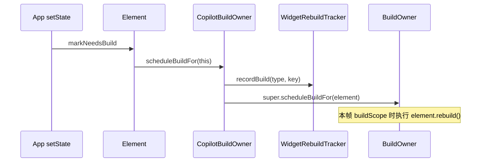

# 基于 BuildOwner Hook 的组件重绘监测实现计划

## 现状与目标

- **现状**：当前仅支持通过手动包裹 [RepaintMonitorWidget](packages/flutter_copilot_claw/lib/src/widgets/repaint_monitor_widget.dart) 上报 rebuild，对业务侵入大。
- **目标**：通过 **BuildOwner Hook** 在框架层统一采集“被调度重建”的 Element，无需业务侧包裹任何 Widget；保留 RepaintMonitorWidget 仅作为可选补充（或后续移除/标记废弃）。

## 技术依据

- Flutter 中 `BuildOwner.scheduleBuildFor(Element)` 会在某 Element 被标记为 dirty 后将其加入脏表，本帧内 `buildScope` 会对其执行 rebuild。
- 在自定义 Binding 中可 **override `buildOwner` getter**，返回自定义的 `BuildOwner` 子类；在子类的 `scheduleBuildFor` 中先调用 `WidgetRebuildTracker.instance?.recordBuild(element.widget.runtimeType.toString(), element.widget.key?.toString())`，再 `super.scheduleBuildFor(element)`，即可无侵入地统计“本帧被调度重建”的 widget（以 type+key 聚合）。
- 注意：统计的是“被 schedule 的 Element”次数（同一帧内同一 Element 通常只被 schedule 一次），与“实际执行 rebuild 的次数”一一对应，可作为重建热点的可靠指标。

## 架构与数据流

- **CopilotBuildOwner**：继承 `BuildOwner`，仅重写 `scheduleBuildFor(Element element)`，在调用 `super.scheduleBuildFor(element)` 前用 `element.widget` 的 `runtimeType` 与 `key` 调用 Tracker 的 `recordBuild`。
- **FlutterCopilotBinding**：在 `initInstances()` 中 `super.initInstances()` 后保存默认 `buildOwner`（用于拷贝 `onBuildScheduled`），构造并持有 `CopilotBuildOwner(onBuildScheduled: _defaultBuildOwner.onBuildScheduled)`；并 override `BuildOwner get buildOwner => _copilotBuildOwner`，使整棵 widget 树使用该实例。
- **WidgetRebuildTracker**：逻辑不变；仍按帧聚合（postFrameCallback）、全局 Map + 当前帧 Map、getSnapshot/getTimeline/getDiff（若已实现 timeline/diff 的环形缓冲与 TopK，可保留或在本期只保证 snapshot）。

## 实现步骤

### 1. 新增 CopilotBuildOwner（BuildOwner 子类）

- **位置**：`packages/flutter_copilot_claw/lib/src/binding/copilot_build_owner.dart`（或置于 `binding/` 下与 configuration 同级）。
- **职责**：
  - 继承 `BuildOwner`，仅重写 `scheduleBuildFor(Element element)`。
  - 在方法内：若 `WidgetRebuildTracker.instance != null`，则 `recordBuild(element.widget.runtimeType.toString(), element.widget.key?.toString())`；然后 `super.scheduleBuildFor(element)`。
  - 不持有 Tracker 引用，仅通过 `WidgetRebuildTracker.instance` 静态访问，避免循环依赖；Tracker 仍由 `enableGlobalRebuildHook()` 时 `ensureInitialized()` 创建。
- **注意**：仅在 `enableGlobalRebuildHook == true` 时 Binding 会创建 Tracker 并注入 CopilotBuildOwner；若为 false，不创建 Tracker，且不应注入 CopilotBuildOwner（即继续使用默认 BuildOwner），因此“是否使用 CopilotBuildOwner”需与 `enableGlobalRebuildHook` 一致。

### 2. 在 FlutterCopilotBinding 中注入 CopilotBuildOwner

- **文件**：[packages/flutter_copilot_claw/lib/src/binding/flutter_copilot_binding.dart](packages/flutter_copilot_claw/lib/src/binding/flutter_copilot_binding.dart)
- **initInstances()**：
  - 调用 `super.initInstances()`。
  - 若 `configuration.enableGlobalRebuildHook` 为 true：先 `WidgetRebuildTracker.ensureInitialized()`，再保存 `_defaultBuildOwner = super.buildOwner`，创建 `_copilotBuildOwner = CopilotBuildOwner(onBuildScheduled: _defaultBuildOwner.onBuildScheduled)`；若为 false，不创建 CopilotBuildOwner、不替换 buildOwner。
- **Getter**：当 `_copilotBuildOwner != null` 时 override `BuildOwner get buildOwner => _copilotBuildOwner!`，否则返回 `super.buildOwner`（保证未开启 hook 时行为与原生一致）。
- **字段**：`BuildOwner? _defaultBuildOwner`、`BuildOwner? _copilotBuildOwner`（类型为 `CopilotBuildOwner?` 更准确，按实际类名）。
- **依赖**：Binding 需 import `CopilotBuildOwner` 与 `WidgetRebuildTracker`。

### 3. WidgetRebuildTracker 保持不变（或按文档补齐）

- 保持现有 [widget_rebuild_tracker.dart](packages/flutter_copilot_claw/lib/src/services/widget_rebuild_tracker.dart)：`recordBuild`、按帧合并、`getSnapshot(topLimit)`、`clear()`。
- 若文档中约定了 **timeline**（环形缓冲最近 N 帧的 per-frame count）与 **diff**（两帧区间内的 total/top），可在本阶段或后续在 Tracker 内增加环形缓冲与 `getTimeline(last)`、`getDiff(from, to)`；本期至少保证 **snapshot** 与 VM Service `flutter_copilot.rebuild.snapshot` 行为不变，数据来源从“仅 RepaintMonitorWidget”变为“BuildOwner scheduleBuildFor”，统计量会显著增加且无需业务改代码。

### 4. RepaintMonitorWidget 的处理（采用方案 A）

- **采用方案 A**：保留该类但标记为 **可选/遗留**，避免破坏已使用 RepaintMonitorWidget 的少数场景。
- 具体做法：文档与 dartdoc 说明“全局 Hook 启用后无需使用；仅在需要单独标记某子树或与旧逻辑兼容时使用”；继续导出 RepaintMonitorWidget；**demo 中不再用 RepaintMonitorWidget 包裹 body**，演示页仅依赖 BuildOwner Hook 的全局统计。

### 5. 演示页（rebuild_demo_page）调整

- **文件**：[example/lib/pages/rebuild_demo_page.dart](example/lib/pages/rebuild_demo_page.dart)
- **demo 中不再用 RepaintMonitorWidget 包裹 body**：移除对 `RepaintMonitorWidget` 的包裹（删除 `RepaintMonitorWidget(child: SingleChildScrollView(...))`，改为直接使用 `SingleChildScrollView(...)`）。
- 保留“定时器模拟错误重绘”的交互（开始/停止定时器、刷新统计、清空）；此时整页因定时器 setState 反复重建，**全局 Hook 会自动记录**该页内被 schedule 的各类 widget（如 Column、Card、Text 等），snapshot 的 top 会自然体现热点。
- “方案说明与局限”卡片：改为说明当前采用 **BuildOwner Hook**，无需在页面内包裹任何组件即可统计整棵树的调度重建；并简要说明 scheduleBuildFor 与 rebuild 的对应关系。

### 5.1 清理与 RepaintMonitorWidget 方案相关的代码与表述

在切换为 BuildOwner Hook 为主方案后，对“之前以 RepaintMonitorWidget 包裹为主”的残留做统一清理（保留 RepaintMonitorWidget 类与导出，但不再作为推荐或唯一数据源）：

- **example/lib/pages/rebuild_demo_page.dart**
  - 移除 `RepaintMonitorWidget` 对 body 的包裹（见步骤 5）。
  - 移除或替换页面顶部注释中的“理想方案是全局 Hook，无需在观察处手动包裹”（已实现，改为“采用 BuildOwner Hook”等表述）。
  - “方案说明与局限”卡片：删除“本页仅在整页 body 外包了一层 RepaintMonitorWidget”及“若要在任意位置观察重建，当前方案需要在该处添加 RepaintMonitorWidget”等表述，改为 BuildOwner Hook 说明。
- **example/lib/pages/home_page.dart**
  - 将「组件重绘监测」入口的 description 由“RepaintMonitorWidget + rebuild.snapshot”改为“BuildOwner Hook + rebuild.snapshot”或“组件重绘监测（全局 Hook）”等，不再突出 RepaintMonitorWidget。
- **packages/flutter_copilot_claw/lib/src/services/widget_rebuild_tracker.dart**
  - 类注释中“Widgets wrapped with RepaintMonitorWidget report builds via recordBuild”改为“BuildOwner hook (and optionally RepaintMonitorWidget) report builds via recordBuild”或“CopilotBuildOwner.scheduleBuildFor and optionally RepaintMonitorWidget call recordBuild”，以 BuildOwner 为主。
- **packages/flutter_copilot_claw/lib/src/binding/flutter_copilot_binding.dart**
  - `enableGlobalRebuildHook()` 的 dartdoc 中“[RepaintMonitorWidget] uses the tracker”改为“CopilotBuildOwner (and optionally RepaintMonitorWidget) use the tracker”或“CopilotBuildOwner injects scheduleBuildFor hook that records to the tracker”。
- **文档/组件重绘监测.md**
  - 按步骤 6 更新第四节、第五节、第七节，删除“仅统计被包裹的 Widget”等以包裹为主的表述。
- **README.md**（若存在“重绘监测”或“RepaintMonitorWidget”的用法说明）
  - 将“推荐用 RepaintMonitorWidget 包裹”改为“启用 enableGlobalRebuildHook 后无需包裹；RepaintMonitorWidget 为可选，用于局部或兼容”。

### 6. 文档更新（组件重绘监测.md）

- **第四节“采集层”**：由“RepaintMonitorWidget + Tracker”改为 **“BuildOwner Hook + Tracker”**：
  - 采集入口：在 `CopilotBuildOwner.scheduleBuildFor` 中根据 `element.widget` 的 type 与 key 调用 `WidgetRebuildTracker.instance?.recordBuild(...)`；无需业务侧包裹。
  - 可选：保留 RepaintMonitorWidget 的简短说明，标注为可选/兼容用途。
- **第五节“文件与职责”**：增加 `copilot_build_owner.dart`（BuildOwner 子类，scheduleBuildFor 中调用 recordBuild）；Binding 职责中注明“在 enableGlobalRebuildHook 为 true 时注入 CopilotBuildOwner”；RepaintMonitorWidget 改为“可选，用于局部标记或兼容”。
- **第七节“风险与注意点”**：删除“仅统计被包裹的 Widget”；增加“BuildOwner 替换依赖对 buildOwner getter 的 override，与 Flutter 版本兼容性需注意”；保留每帧 TopK + __other__、环形缓冲、Release 关闭等说明。

### 7. 配置与 Release

- 保持 [FlutterCopilotConfiguration.enableGlobalRebuildHook](packages/flutter_copilot_claw/lib/src/binding/flutter_copilot_configuration.dart) 现有语义：为 true 时启用全局重建统计（创建 Tracker + 注入 CopilotBuildOwner）；为 false 时不创建 Tracker、不注入自定义 BuildOwner，扩展可返回未启用或空数据。
- Release 下建议默认或由业务显式设为 false，以省开销。

### 8. 导出与依赖

- 若 CopilotBuildOwner 需对外暴露（例如测试或高级用法），可在 [flutter_copilot_claw.dart](packages/flutter_copilot_claw/lib/flutter_copilot_claw.dart) 中 export；否则仅包内使用可不导出。
- RepaintMonitorWidget 若保留则继续导出；Tracker 已导出，保持不变。

## 风险与注意

- **Flutter 版本**：BuildOwner 的 API（如 `scheduleBuildFor` 签名、`onBuildScheduled`）在 Flutter 升级时可能变化，需在测试矩阵中覆盖当前支持的 Flutter 版本。
- **多 BuildOwner**：若应用或测试中存在多个 BuildOwner（例如部分子树使用独立 BuildOwner），当前方案只替换 Binding 的默认 buildOwner，其它树不会进入 CopilotBuildOwner，仅主树被统计，属于预期。
- **性能**：scheduleBuildFor 每帧调用次数与 dirty 元素数一致，recordBuild 为 O(1)；若后续开启 timeline/diff 的每帧 TopK 落盘，按文档 3.1.1 做 K+1 条限制即可。

## 小结

| 项目 | 内容 |

|------|------|

| 新增 | `CopilotBuildOwner`（scheduleBuildFor 中 recordBuild） |

| 修改 | `FlutterCopilotBinding`：initInstances 创建并注入 CopilotBuildOwner，override buildOwner getter |

| 保留 | `WidgetRebuildTracker`、VM Service `rebuild.snapshot`；RepaintMonitorWidget 保留为可选（方案 A） |

| 演示 | demo 中不再用 RepaintMonitorWidget 包裹 body；rebuild_demo_page 仅用定时器 + 刷新统计验证全局 Hook 统计 |

| 清理 | 移除 demo 中 RepaintMonitorWidget 包裹；更新 Tracker/Binding 注释、home 入口描述、设计文档与 README 中“以包裹为主”的表述，改为以 BuildOwner Hook 为主 |

| 文档 | 采集层改为 BuildOwner Hook，文件与职责、风险与注意点同步更新 |

按上述步骤即可在不大改业务代码的前提下，通过 BuildOwner Hook 实现组件重绘监测，并清理与 RepaintMonitorWidget 方案相关的代码与表述。