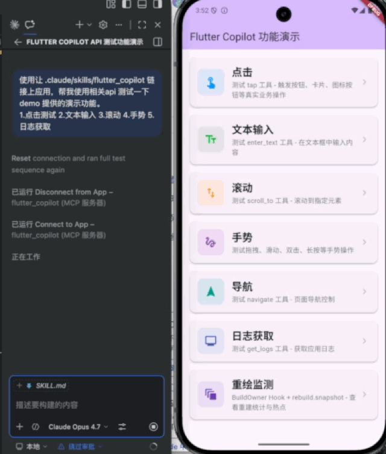
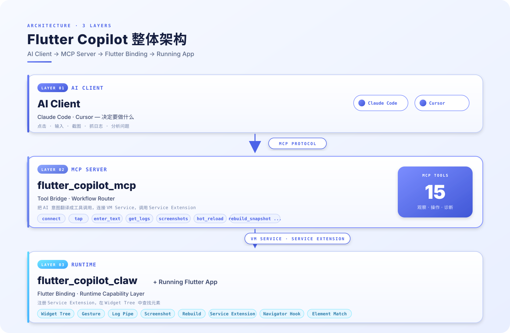
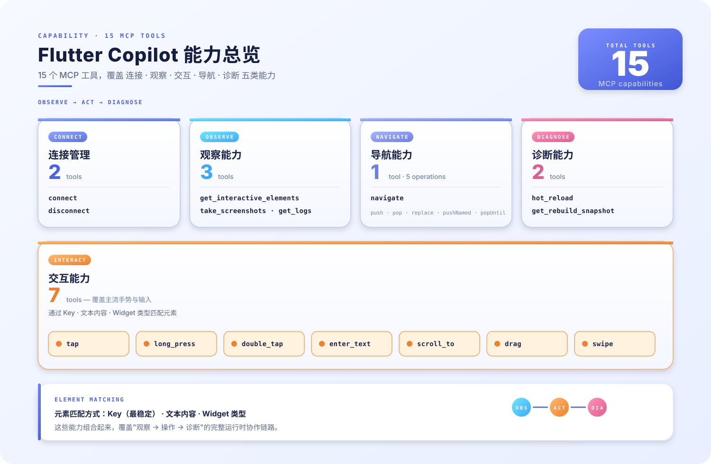

# Flutter Copilot


[](https://pub.dev/packages/flutter_copilot_mcp)
[](https://pub.dev/packages/flutter_copilot_claw)

**Flutter Copilot 是一个面向运行中 Flutter 应用的 MCP 方案，让 Claude Code、Cursor 等 AI Agent 能够直接连接、观察、操作和诊断 App。**

它通过 `MCP + VM Service` 把 AI 工具和 Flutter 运行时连接起来，让 Agent 不只停留在代码层面，还能进入真实应用状态完成页面验证、交互调试、日志排查和运行时诊断。

## Demo

<a href="docs/video/演示视频.mp4">
  
</a>

Flutter Copilot 包含两个已发布到 pub.dev 的包：

- [`flutter_copilot_mcp`](https://pub.dev/packages/flutter_copilot_mcp)：MCP Server，负责让 Claude Code、Cursor 等 AI Client 连接并调用 Flutter 能力
- [`flutter_copilot_claw`](https://pub.dev/packages/flutter_copilot_claw)：Flutter 侧挂载插件，负责在 App 内注册运行时能力

更多演示功能请查看[演示视频](docs/video/演示视频.mp4)。

## 项目概述

Flutter Copilot 由两部分组成，均已发布到 pub.dev：

- [`flutter_copilot_mcp`](https://pub.dev/packages/flutter_copilot_mcp)：运行在 App 外部的 MCP Server，对 AI Client 暴露标准工具能力
- [`flutter_copilot_claw`](https://pub.dev/packages/flutter_copilot_claw)：集成在 Flutter App 内的运行时挂载插件，负责注册 VM Service 扩展



一句话理解：

> `flutter_copilot_claw` 在 App 内提供能力，`flutter_copilot_mcp` 在 App 外桥接 AI，最终让 Agent 可以直接操作运行中的 Flutter 应用。

## 适用场景

Flutter Copilot 适合这些典型场景：

- 页面交互验证
- 冒烟测试与流程回归
- UI 问题复现与调试
- 运行时日志采集
- 热重载后的快速确认
- Widget 重建热点排查

## 核心能力



### 连接与观察

- 连接 Flutter App 的 VM Service
- 获取当前页面可交互元素
- 截图与日志获取

### 交互与导航

- 点击、输入、滚动
- 拖拽、滑动、长按、双击
- 页面导航控制
- Hot Reload

### 诊断能力

- Rebuild Snapshot / 重建热点分析

### 元素定位方式

- `ValueKey<String>`
- 文本内容
- Widget 类型
- 坐标

其中 `ValueKey<String>` 是最稳定、最推荐的方式。

## 工作原理


Flutter Copilot 的调用链路可以概括为：

1. AI Client 发起工具调用
2. `flutter_copilot_mcp` 将调用转换为 Flutter 可执行的操作
3. `flutter_copilot_claw` 在运行中的 App 内通过 VM Service 扩展执行操作
4. 结果以截图、日志、状态或结构化文本返回给 AI Client

这使得 AI 可以直接基于 Flutter 运行时状态进行判断，而不是只依赖源码或屏幕像素猜测。

## Quick Start

如果你是第一次接触这个项目，建议从 [`flutter_copilot_mcp`](https://pub.dev/packages/flutter_copilot_mcp) 开始；它是主要入口，包含安装、快速开始、工具列表和 Agent 配置方式。`flutter_copilot_claw` 则负责 Flutter 侧运行时挂载。

### 1. Add `flutter_copilot_claw` to your Flutter app

```bash
flutter pub add flutter_copilot_claw
```

在 `main.dart` 中初始化 Flutter Copilot。

只需要 UI 交互能力时：

```dart
import 'package:flutter/foundation.dart';
import 'package:flutter/material.dart';
import 'package:flutter_copilot_claw/flutter_copilot_claw.dart';

void main() {
  if (kDebugMode) {
    FlutterCopilotBinding.ensureInitialized();
  } else {
    WidgetsFlutterBinding.ensureInitialized();
  }

  runApp(const MyApp());
}
```

如果你还希望 Agent 可以读取 `print()` 输出和未捕获错误：

```dart
void main() {
  if (kDebugMode) {
    FlutterCopilotBinding.runAppWithConfig(const MyApp());
  } else {
    WidgetsFlutterBinding.ensureInitialized();
    runApp(const MyApp());
  }
}
```

### 2. Install `flutter_copilot_mcp`

全局安装：

```bash
dart pub global activate flutter_copilot_mcp
```

或者作为开发依赖安装：

```bash
dart pub add dev:flutter_copilot_mcp
```

### 3. Run your Flutter app in debug mode

```bash
flutter run
```

从控制台拿到 VM Service URI，例如：

```text
ws://127.0.0.1:12345/ws
```

### 4. Configure the MCP server in your Agent

#### Claude Code

```bash
claude mcp add --scope project --transport stdio flutter_copilot_mcp -- flutter_copilot_mcp
```

如果你是在当前仓库里直接调试源码：

```bash
claude mcp add --scope project --transport stdio flutter_copilot_mcp -- dart run ./packages/flutter_copilot_mcp/bin/flutter_copilot_mcp.dart -l FINEST
```

#### Cursor

Cursor 通过 `.cursor/mcp.json` 读取 MCP 配置：

```json
{
  "mcpServers": {
    "flutter_copilot": {
      "type": "stdio",
      "command": "flutter_copilot_mcp"
    }
  }
}
```

### 5. Connect and use the app

完成配置后，推荐按下面的顺序使用：

1. 调用 `connect`，传入 VM Service URI
2. 调用 `get_interactive_elements`、`take_screenshots`、`get_logs` 了解当前页面状态
3. 再调用交互工具，例如：
   - `tap`
   - `enter_text`
   - `scroll_to`
   - `flutter_copilot_drag`
   - `swipe`
   - `long_press`
   - `double_tap`
   - `navigate`
4. 在需要时调用：
   - `hot_reload`
   - `get_rebuild_snapshot`

为了让 Agent 更稳定地操作 Flutter App，建议：

- 优先给关键元素添加 `ValueKey<String>`
- 先从核心路径开始接入，例如登录、表单、详情页
- 调试阶段优先使用 Debug 模式
- 在需要日志和异常信息时启用 `runAppWithConfig`

### 6. Use the `flutter-copilot` skill for auto-connect

如果你在觉得上面手动链接的方案，不方便，请使用项目使用本仓库内置的 `flutter-copilot` skill，可以使用更自动化的连接方案。

这个 skill 会优先从项目根目录的 `.vm_service_uri` 文件读取当前 Flutter App 的 VM Service URI，再完成 Flutter Copilot MCP 连接。相比手动复制 URI，这种方式更适合持续调试、截图验证和热重载后的重复连接。

推荐流程：

1. 通过项目里的启动方式运行 Flutter App，例如 `scripts/flutter_run.sh` 或对应的 VS Code 启动配置
2. 确认项目根目录下已经生成 `.vm_service_uri`
3. 在 Claude Code 中使用 `flutter-copilot` skill，让它自动读取 URI 并连接
4. 后续继续使用截图、点击、输入、滚动、热重载等能力

这种方式特别适合：

- 频繁重启 App 后重新连接
- 需要快速截图或验证 UI 修改结果
- 把 Flutter Copilot 作为其他 skill 的前置能力

如果应用重启后 URI 变化，只需要重新使用 `flutter-copilot` skill，它会按新的 `.vm_service_uri` 重新连接。

## 平台支持

| Platform | Support | Notes                    |
| -------- | ------- | ------------------------ |
| Android  | ✅      | Debug mode               |
| iOS      | ✅      | Debug mode               |
| Web      | ✅      | 部分诊断能力存在平台差异 |
| macOS    | ✅      | Debug mode               |
| Windows  | ✅      | Debug mode               |
| Linux    | ✅      | Debug mode               |

实际能力依赖 Flutter 调试能力与 VM Service，可用性以调试模式下的运行环境为准。

## 仓库结构

- [packages/flutter_copilot_mcp/](packages/flutter_copilot_mcp/) — MCP Server 与工具桥接层
- [packages/flutter_copilot_claw/](packages/flutter_copilot_claw/) — Flutter 侧运行时绑定与 VM Service 扩展
- [example/](example/) — 示例应用
- [tool/](tool/) — 仓库工具脚本
- [docs/](docs/) — 补充文档

## 相关文档

- [项目说明](docs/项目说明.md)
- [VM Service 连接原理与实现](docs/VM_Service连接原理与实现.md)
- [Claude Code 调试本地 MCP 教程](docs/ClaudeCode调试本地MCP教程.md)
- [flutter_copilot_mcp README](packages/flutter_copilot_mcp/README.md)
- [flutter_copilot_claw README](packages/flutter_copilot_claw/README.md)

## License

Apache License 2.0
