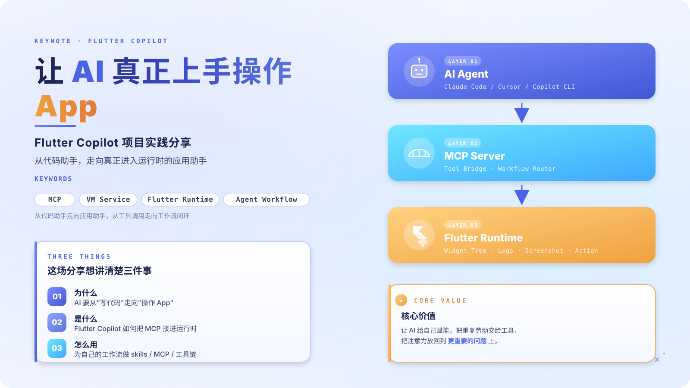
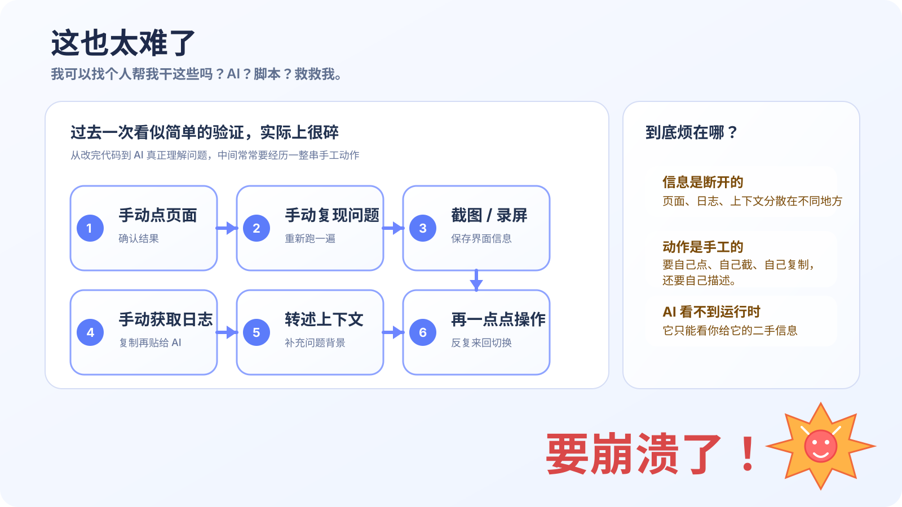
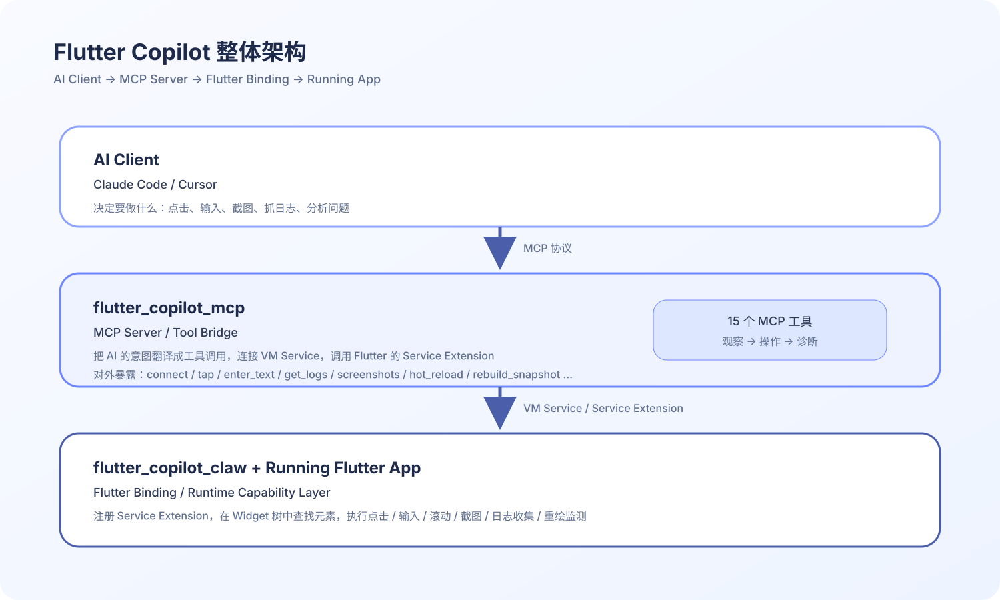
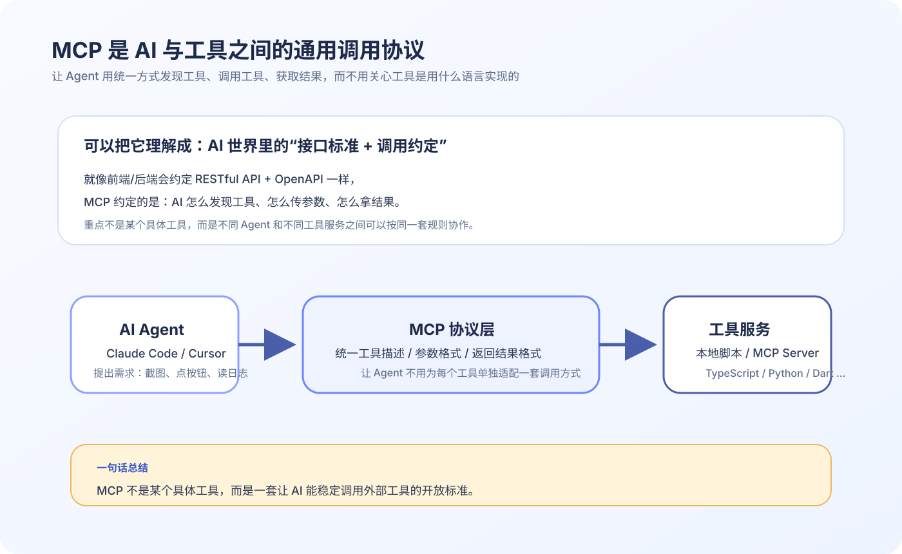
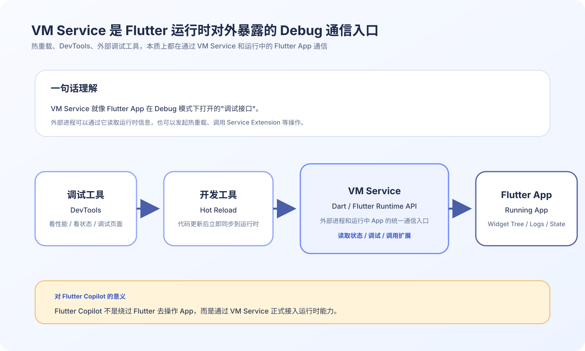
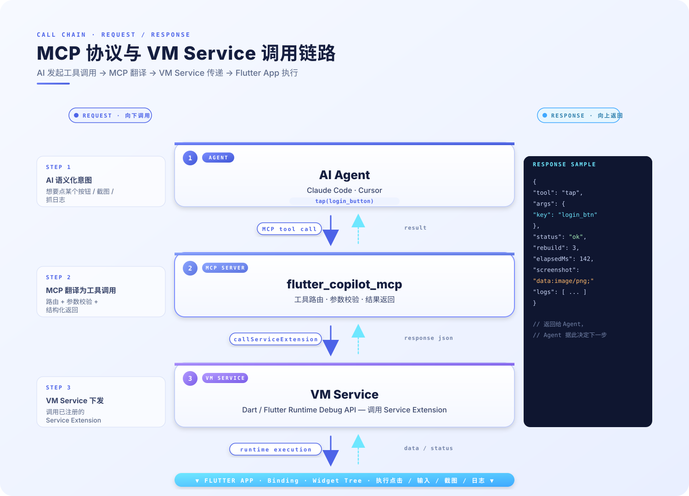
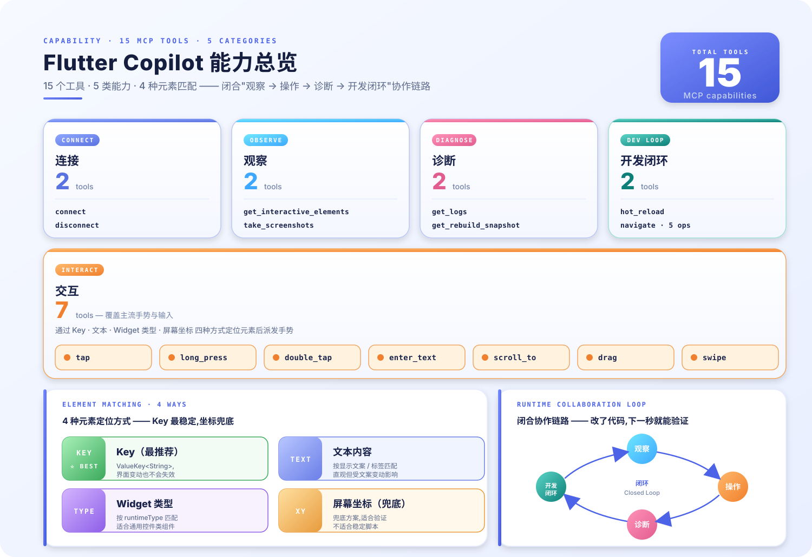
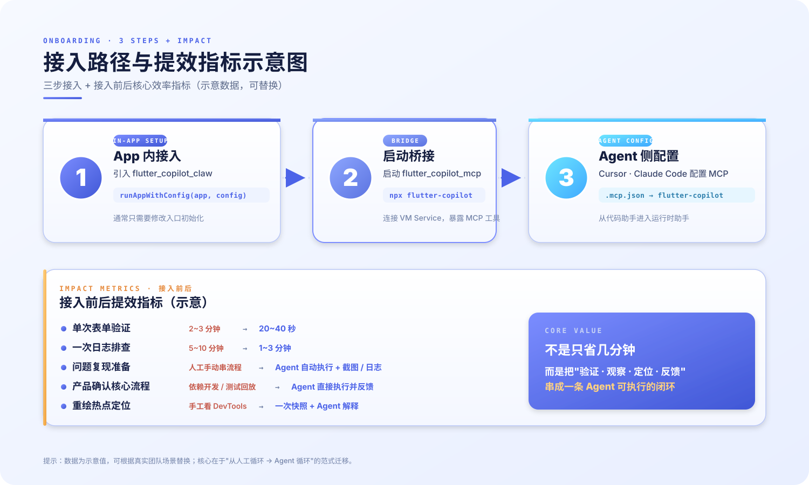
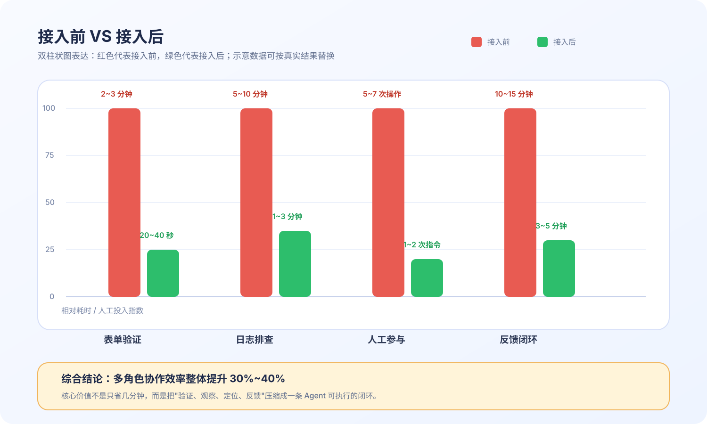
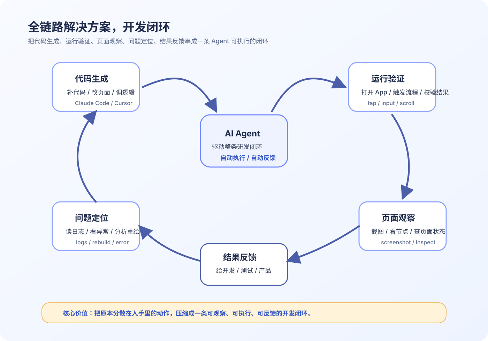

# 让 AI 真正上手操作 App

**Flutter Copilot 项目实践分享**



> 演讲时长：约 25 分钟 | 受众：产品、研发、Flutter、后端、设计

---

## 一、开场：我为什么要做这件事
*配图建议：这一章用两张图更合适——第一页沿用封面图【0-0-1】，第二页切到这张痛点示意图【1-1-1】《这也太难了》。*

大家好，今天想和大家分享一个我最近做的开源项目，叫 Flutter Copilot。

我做它的起点其实很简单。去年看到一些 AI 操作浏览器的案例时，我当时就在想：既然 AI 已经可以打开页面、点按钮、填表单、截图、读日志，**为什么 Flutter 不行？**

因为我们今天说 AI 提效，很多时候还停留在代码层面。但真正耗时间的，往往是写完代码之后的验证和排查：
- 要自己点页面确认结果
- 要自己复现问题、截图录屏
- 要自己获取日志贴给 AI
- 要再把上下文转述给 AI
- 还要自己一点点把流程重新操作一遍



问题不是 AI 写代码不够快，而是它**看不到**你的 App。

所以我想做的事情很明确：给 AI 装一双眼睛和一双手，让它不只是帮我写代码，还能直接进入一个运行中的 Flutter App，去看、去点、去验证。

Flutter Copilot 就是从这里开始的。

**一句话说清楚：它是一个桥接层，让 Claude Code、Cursor 这样的 AI，能够直接连接并操作运行中的 Flutter 应用。**

接下来我先让大家看看它实际能做什么，然后再聊技术实现。

---

## 二、效果演示
*配图建议：这一章尽量放真实演示截图或录屏关键帧，不建议再放原理图。*

### 场景 A：AI 帮你验证一个表单流程

> 以前的做法：改完代码 → 热重载 → 自己打开页面 → 手动输入 → 手动点提交 → 看结果 → 不对再改 → 再来一遍。一次验证少说 2-3 分钟。
>
> 现在的做法：告诉 AI "帮我试一下登录流程"，它自己连接 App、找到输入框、输入内容、点击按钮、截图告诉你结果。

**[建议新增配图：AI 自动执行登录/表单流程的终端对话 + App 页面结果截图]**

*预期效果：观众看到 AI 自动连接 App → 识别页面元素 → 输入文本 → 点击按钮 → 返回截图和执行结果。全程无需人工操作。*

---

### 场景 B：结合 Figma MCP 和 skills 开发页面并修复 UI Bug

> 以前的做法：设计稿在 Figma，页面在 Flutter，改一个 UI 问题要来回对照设计稿、手工改代码、重新运行、再截图确认，反复很多轮。
>
> 现在的做法：让 AI 结合 Figma MCP 读取设计信息，再配合 skills 和 Flutter Copilot 一起改页面、运行 App、对照效果，发现 UI 偏差后继续修复，直到接近设计稿。

**[建议新增配图：Figma 设计稿、Flutter 页面修复前、修复后三栏对比图]**

*预期效果：观众看到 AI 读取 Figma 设计信息，生成或修改 Flutter 页面代码，运行 App 后再对照界面结果继续修复 UI Bug，形成“设计 → 实现 → 验证 → 调整”的闭环。*

---

### 场景 C：AI 自动抓取日志并分析异常

> 以前的做法：App 出了错 → 翻控制台日志 → 复制粘贴给 AI → AI 分析 → 再回去看代码。中间来回切换好几次。
>
> 现在的做法：AI 直接从运行中的 App 抓日志，拿到错误信息后立即分析，一步到位。

**[建议新增配图：AI 获取日志并给出异常定位结论的截图]**

*预期效果：观众看到 AI 调用 `get_logs` 获取运行日志，自动识别错误信息，结合上下文给出问题定位。*

---

大家可以感受到，这三个场景有一个共同点：**AI 不再只是读你的代码，它在读你的 App。**

它看到的不是源码文本，而是运行中的真实状态——页面上有什么元素、点击后发生了什么、日志里输出了什么、哪些组件在反复重建。

这就是从"代码助手"到"应用助手"的区别。

---

## 三、技术揭秘

效果看完了，接下来聊聊它是怎么做到的。我尽量讲得所有人都能听懂。

### 1. 整体架构：三层，各管一件事




简单讲就是三句话：
- **最上层**：AI 决定要做什么（比如"点击登录按钮"）
- **中间层**：MCP Server 把 AI 的意图翻译成 Flutter 能理解的指令
- **最下层**：Flutter App 内部真正去执行这个操作，然后把结果返回

如果拿大家熟悉的概念类比：中间层就像一个 **API 网关**，上面对接 AI 客户端，下面对接 Flutter 运行时。

### 2. 两个关键协议

这里面有两个协议比较关键，我分开讲。

#### 2.1 MCP（Model Context Protocol）

MCP 是 AI 和工具之间的标准协议。

你可以把它理解成：AI 世界的 RESTful API 规范。它定义了“AI 怎么发现工具、怎么调用工具、怎么拿到结果”。有了这层标准，不管是 Claude Code 还是 Cursor，都能用同一套接口操作 Flutter App。

如果你想给自己的技术栈也接一个类似的 AI 能力，MCP 协议也是开放的。



我们这个项目的 Dart MCP Server 源码在：
- `packages/flutter_copilot_mcp/lib/src/vm_service/vm_service_context.dart`

核心思路就是：注册工具 → 处理调用 → 通过 VM Service 执行 → 返回结果。

#### 2.2 VM Service

VM Service 是 Dart/Flutter 在 Debug 模式下暴露的运行时调试服务。

我们平时用的热重载、DevTools 调试，底层都是 VM Service。它提供了一个正式的入口，让 App 外部的进程可以和运行中的 App 通信。



Flutter Copilot 这一套能力最终对外体现为 15 个 MCP 工具，覆盖连接、观察、交互、导航、诊断等几个核心方向；底层则通过 App 内部能力和 VM Service 调用链路把这些动作真正执行起来。

### 3. 一条真实的调用链路

**所以整个链路是这样的：AI 说话 → MCP 翻译 → VM Service 传达 → Flutter App 执行。**



这张图放在这里更合适，因为前面刚讲完 MCP 和 VM Service，这里正好把“协议”和“真正执行”之间的关系连起来。


这里最关键的一点是：**AI 不是在模拟"点击屏幕坐标 (200, 350)"，而是在 Flutter 的 Widget 树里找到语义化的目标元素，然后派发手势。**

打个比方：坐标点击就像闭着眼睛用手指戳屏幕，界面稍微变一下就点错了；而 Flutter Copilot 是拿着遥控器，按的是"登录按钮"这个名字，不管按钮移到哪里都能点中。

### 4. 它到底有多少能力

给大家看一张总览图：



你在现场讲这一页时，可以先从“15 个 MCP 工具”总数切进去，再按连接、观察、交互、导航、诊断五类往下拆。

支持 3 种元素匹配方式：**Key（最稳定）、文本内容、Widget 类型**。

这些能力组合起来，就能覆盖"观察 → 操作 → 诊断"一条完整的运行时协作链路。

---

## 四、接入指南
前面讲了这么多，大家最自然的一个问题就是：**这个东西到底怎么接？复杂不复杂？**

我把它总结成三步，核心原则就是：**App 内加能力、App 外起桥接、Agent 侧做配置。**



这张图建议你在接入指南这里先展示上半部分，讲完三步之后，再顺势切到下半部分讲提效指标。

### 第一步：Flutter App 内接入 `flutter_copilot_claw`

业务 App 侧的接入其实很轻量，核心就是初始化 Binding。

你在现场可以直接强调一句：**大多数业务 App 的第一步接入成本非常低，通常只需要改入口初始化。**

像示例工程里的 `main()`，实际就是这样接的：

```dart
import 'package:flutter/foundation.dart';
import 'package:flutter/material.dart';
import 'package:flutter_copilot_claw/flutter_copilot_claw.dart';

void main() {
  if (kDebugMode) {
    FlutterCopilotBinding.ensureInitialized();
  } else {
    WidgetsFlutterBinding.ensureInitialized();
  }

  runApp(const MyApp());
}
```

如果你希望 AI 还能直接抓异常和日志，也可以把启动方式换成：

```dart
void main() {
  if (kDebugMode) {
    FlutterCopilotBinding.ensureInitialized();
    FlutterCopilotBinding.addLog('sss');
  } else {
    WidgetsFlutterBinding.ensureInitialized();
    runApp(const MyApp());
  }
}
```

所以这一部分最想传达给大家的感觉不是“接入很复杂”，而是：**它真的就是从 App 入口多改几行代码开始的。**

### 第二步：在 App 外启动 `flutter_copilot_mcp`

第二步是把 MCP Server 起起来。

它的作用不是运行在 App 里，而是运行在 App 外，负责：
- 连接 VM Service
- 查找暴露 Copilot 扩展的 isolate
- 把 Flutter 运行时能力转换成 MCP 工具

这一步可以通过：
- 全局安装 `flutter_copilot_mcp`
- 或直接在项目源码里 `dart run` 启动

### 第三步：在 Agent 侧完成 MCP 配置

最后一步是让 Claude Code、Cursor 这样的 Agent 认识这个 MCP Server。

比如：
- Cursor 侧配置 `.cursor/mcp.json`
- Claude Code 侧通过 `claude mcp add` 注册项目级 MCP

当这一步完成之后，Agent 才真正知道：
- 它有哪些工具可以调
- 每个工具的名字是什么
- 应该怎么传参数

如果你想在分享里给大家一个更直观的例子，可以直接放一段 Cursor 的 MCP 配置示例：

```json
{
  "servers": {
    "flutter_copilot": {
      "type": "stdio",
      "command": "/Users/chenhui/.pub-cache/bin/flutter_copilot_mcp",
      "args": []
    },
    "figma_mcp": {
      "type": "stdio",
      "command": "npx",
      "args": [
        "-y",
        "figma-developer-mcp",
        "--stdio"
      ],
      "env": {
        "FIGMA_API_KEY": "<YOUR_FIGMA_API_KEY>"
      }
    }
  }
}
```

这段配置的作用很简单：一边把 Flutter Copilot 挂给 Agent，让它能操作运行中的 Flutter App；另一边把 Figma MCP 也接进来，让它能同时读取设计信息，形成“设计 + 运行验证”一起协作的效果。

### 接入后的最佳实践

如果你想让接入效果更稳定，我建议强调三点：

1. **关键元素加 `ValueKey<String>`**
   - 这是最稳定的定位方式
   - 比按文本、按类型都更可靠

2. **优先从示例页面或核心流程开始接入**
   - 不要一上来追求覆盖整个业务 App
   - 先从登录、表单、详情页这种路径最容易体现价值

3. **把它定位成开发阶段的效率工具**
   - 它特别适合调试、验证、排查
   - 但不要一开始就把它当成对测试框架或线上监控的替代品

换句话说，这个项目最好的落地方式不是“大而全”，而是先找到一个高频、重复、适合被 AI 接管的小场景，把价值打出来。

---

## 五、接入前后数据对比：它到底带来了多少提效

我觉得一场分享如果只讲“能做什么”，说服力还不够，最好还要回答一个问题：

**接入前和接入后，到底差了多少？**

这一部分我先给一个你后续可以替换真实数据的框架，重点是把“提效”讲具体，而不是只讲感觉。

### 1. 可以从这几个指标去看

建议重点看四类指标：

- **单次验证耗时**：一次页面验证从开始到拿到结果需要多久
- **问题定位耗时**：从发现异常到拿到有效线索需要多久
- **人工参与次数**：一个流程里需要人工点几次、切换几次工具
- **反馈闭环时长**：产品 / 测试 / 开发从提出问题到确认结果需要多久

### 2. 接入前后对比示例



> 下面这组数字你后面可以替换成真实数据，我先帮你把表达方式搭好。

| 指标 | 接入前 | 接入后 | 预期变化 |
|------|--------|--------|----------|
| 单次表单验证耗时 | 2~3 分钟 | 20~40 秒 | 缩短 60%~80% |
| 一次日志排查耗时 | 5~10 分钟 | 1~3 分钟 | 缩短 50%~70% |
| 问题复现准备动作 | 手工打开页面、输入、截图、复制日志 | Agent 自动执行 + 自动拿日志截图 | 大幅减少人工操作 |
| 产品确认一个核心流程 | 需要开发或测试配合回放 | Agent 可直接执行并反馈结果 | 反馈链路明显缩短 |
| 重绘热点定位 | 手工看 DevTools + 自己分析 | 一次快照 + Agent 辅助解释 | 分析门槛下降 |

**综合来看：多角色协作效率整体提升 30%~40%。**

### 3. 目前接入的团队

目前已经有两个团队在使用 Flutter Copilot：

- **映客主版**：主 App 团队，覆盖核心业务流程的调试与验证
- **创新团队 Mint**：新产品线，从项目初期就接入，用于快速迭代和 UI 验证

### 4. 全链路解决方案，开发闭环



Flutter Copilot 带来的不只是“操作更自动化”，而是让“代码生成 → 运行验证 → 页面观察 → 问题定位 → 结果反馈”第一次变成了一条可以被 AI 串起来的完整闭环。

---

## 六、价值升华
前面我讲了这个项目怎么做、能做什么、能带来多少提效。最后我想再往上收一层，讲讲这件事真正值得我们关注的价值到底是什么。

### 1. AI 的价值，不只是写代码，而是进入工作流

我觉得这件事最重要的，不是“我做了一个 Flutter MCP”，而是它背后代表了一种新的方法论：

**不要只让 AI 参与写代码，而要让 AI 进入完整工作流。**

过去我们的研发流程往往是割裂的：人写代码、人跑应用、人点页面、人看日志、人描述问题，AI 再基于这些文字给建议。

而 Flutter Copilot 做的一件事，就是把这条链路重新串起来：

**代码生成 → 运行验证 → 页面观察 → 问题定位 → 结果反馈**

一旦这条链路打通，AI 就不再只是一个“回答问题的助手”，而开始变成一个真正参与执行的协作者。

### 2. 真正适合 AI 切入的，是高频、重复、可验证的问题

真正能在工作里落地的，往往不是最炫的能力，而是那些最具体的问题。

比如流程验证、日志排查、UI 对比、结果确认，这些事情都有几个共同点：高频、重复，而且结果可验证。

所以让 AI 赋能，不是先问“AI 能做什么”，而是先问：**我们工作里最值得被 AI 接管的重复动作是什么。**

### 3. 给大家真正的启发：从自己的工作场景出发

如果回头看这个项目，它并不是从“我要做个平台”开始的，而是从一句很具体的话开始的：

**这件事为什么还要我手工做？**

很多有价值的工具，往往就是这样长出来的：先发现真实痛点，再把高频动作沉淀成可复用的能力，最后慢慢长成自己的工作流。

如果今天这场分享最后只能让大家带走一件事，我希望不是“Flutter Copilot 这个项目挺有意思”，而是：

**你完全可以基于自己的工作场景，去探索属于你自己的 AI 工作流。**

不一定非要是 Flutter，也不一定非要从一个完整项目开始。

你可以从自己的痛点出发，反过来想：
- 有没有一件事是你每天都在重复做的？
- 有没有一类问题总要靠你手工排查、手工验证、手工整理？
- 有没有一些流程，本来很机械，却一直占着你的注意力？

如果有，那你就可以开始做四件事：
- **把流程沉淀成 skills**：把常用步骤变成可复用的操作模板
- **把能力封装成 MCP**：把原来只能手工完成的动作，变成 AI 可调用的工具
- **把经验固化成 CLI 工具**：把团队里重复出现的问题，做成自己随时可用的小工具
- **把上下文蒸馏成自己的 AI 记忆**：把你的习惯、方法、判断标准慢慢沉淀下来，最终发展成属于每个人自己的“claw bot”和“Hermes”

### 4. 最后的落点：不是做一个酷项目，而是解决真实问题

这件事最现实的价值，不是“做一个很酷的 AI 项目”，而是：

**解决自己的真实痛点，解放双手，把注意力从重复劳动里拿回来，放到更重要的问题上。**

比如：
- 更重要的架构判断
- 更重要的产品决策
- 更重要的异常分析
- 更重要的跨团队协作

所以我想表达的不是“大家都来用我这个项目”，而是：

**希望这个项目能给大家一个启发：你也可以为自己的工作流，做一套自己的 skills、自己的 MCP、自己的工具链。**

当你开始这样做的时候，AI 才真正不是一个聊天窗口，而是开始变成你工作系统里的一部分。

### 项目地址

| 资源 | 链接 |
|------|------|
| **GitHub（源码 + 文档）** | https://github.com/dust365/flutter_copilot |
| **flutter_copilot_mcp**（MCP Server） | https://pub.dev/packages/flutter_copilot_mcp |
| **flutter_copilot_claw**（Flutter 端） | https://pub.dev/packages/flutter_copilot_claw |

两个包都已发布到 pub.dev，可以直接安装使用。
欢迎 Star、提 Issue、提 PR，一起把这个东西做得更好。

---

## 附录

### 附录 A：MCP 官方资源与开发指引

官方资源：
- **官网**：https://modelcontextprotocol.io/
- **快速开始**：https://modelcontextprotocol.io/quickstart
- **协议规范**：https://spec.modelcontextprotocol.io/specification/

各语言 SDK / 开发指引：
- **TypeScript**：https://github.com/modelcontextprotocol/typescript-sdk
- **Python**：https://github.com/modelcontextprotocol/python-sdk
- **Java**：参考协议规范，用 JSON-RPC 库自行实现
- **Go / Rust / 其他**：只要实现 JSON-RPC over stdio + MCP 格式即可

---

## 结尾

最后一句话总结：

**过去的 AI 是一个写代码的助手，Flutter Copilot 想做的，是让 AI 成为一个能看到应用、操作应用、理解应用的协作者。**

谢谢大家，欢迎会后交流。
