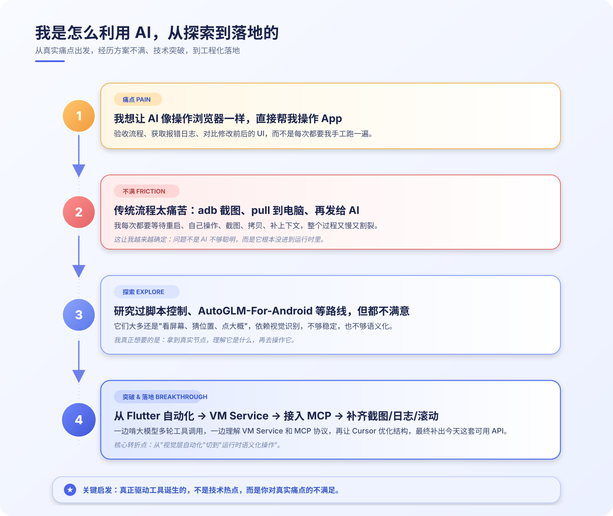

# 让 AI 真正上手操作 App

**Flutter Copilot 项目实践分享（v3）**

> 演讲时长：约 25 分钟 | 受众：产品、研发、Flutter、后端、设计

---

## 一、开场：我为什么要做这件事（3 分钟）

大家好，今天想和大家分享一个我最近做的开源项目，叫 Flutter Copilot。

在讲它是什么之前，我想先讲一个很直接的感受。

去年我看到一些 AI 操作浏览器的案例时，第一反应是：**这也太爽了。**

它不是帮你写前端代码，而是直接打开页面、点按钮、填表单、截图、读日志，自己完成一次完整验证。

然后我的第二反应就是：**为什么 Flutter 没有？**

我们今天说 AI 提效，很多时候还停留在代码层面：
- 帮你生成代码
- 帮你补注释
- 帮你写测试
- 帮你读文档

但真正消耗我们时间的，往往不是写代码，而是写完代码之后的那些事：
- 改了一行代码，要自己跑起来点半天才知道对不对
- 出了 bug，要截图、录屏、补上下文给 AI 看
- 产品问流程通了没，你得自己跑一遍再回复
- 测试反馈问题，你得先自己复现一遍

也就是说，**AI 写代码可以很快，但它看不到你的 App。**

所以我当时就在想：能不能给 AI 装一双眼睛和一双手，让它不只是帮我写代码，还能直接进入一个运行中的 Flutter App，去看、去点、去验证？

Flutter Copilot 就是这么开始的。

**一句话说清楚：它是一个桥接层，让 Claude Code、Cursor 这样的 AI，可以直接连接并操作运行中的 Flutter 应用。**

接下来我先不讲原理，先给大家看它到底能做什么。

---

## 二、先看结果：它到底能帮我们做什么（8-10 分钟）

我想先用三个场景，把它的价值讲透。

### 场景 A：AI 自己跑完一个表单流程

以前我们验证一个表单流程，通常是这样：

改完代码 → 热重载 → 自己打开页面 → 手动输入 → 手动点提交 → 看结果 → 不对再改 → 再来一遍。

一次下来，少说也要 2 到 3 分钟。

现在的方式是：你只要告诉 AI，**“帮我跑一下登录流程。”**

它会自己连接 App，找到输入框，输入内容，点击按钮，最后把结果和截图直接返回给你。

本质上，它省掉的不是一次点击，而是一整段重复验证动作。

**[建议新增配图：AI 自动执行表单流程的终端/对话 + App 截图]**

---

### 场景 B：AI 一边改 UI，一边对照效果继续修

第二个场景，是我自己觉得很有意思的。

以前一个 UI 问题，设计稿在 Figma，页面在 Flutter，改的过程通常很碎：
- 对照设计稿
- 手工改代码
- 重新运行
- 截图确认
- 再改一轮

如果还原得不够准，就继续来回折腾。

现在可以让 AI 结合 Figma MCP 读取设计信息，再配合 Flutter Copilot 去运行 App、观察结果、继续调整。

也就是说，它不只是“帮你生成一个页面”，而是能进入一个真正的闭环：

**设计 → 实现 → 验证 → 调整**

这件事的价值在于，AI 开始参与页面落地，而不只是停留在生成代码那一步。

**[建议新增配图：Figma 设计稿 vs Flutter 页面修复前后对比]**

---

### 场景 C：AI 直接抓日志定位异常

第三个场景，是排查问题。

以前 App 出错时，我们经常这样做：
- 先看控制台日志
- 复制报错
- 再粘贴给 AI
- 再补一堆上下文
- 最后回到代码里继续定位

中间要来回切换很多次。

现在不一样。

AI 可以直接从运行中的 App 抓日志，看到错误之后，立刻结合上下文分析问题。

这时候它不是在猜，而是直接拿到了运行时信息。

**[建议新增配图：AI 获取日志并定位异常的示例截图]**

---

如果把这三个场景放在一起看，你会发现一个共同点：

**AI 不再只是读你的代码，它开始读你的 App。**

它看到的不是源码文本，而是运行中的真实状态：
- 页面上现在有什么
- 点击之后发生了什么
- 日志里报了什么错
- 哪些组件在重复刷新

这就是从“代码助手”到“应用助手”的区别。

---

## 三、为什么它能做到：不是自动点屏幕，而是接进 Flutter 运行时（7-8 分钟）

效果看完了，接下来我讲一下原理。但我尽量讲得简单一点。

### 1. 整体架构其实只有三层

**[配图：整体架构图]**

简单讲就是三句话：
- **最上层**：AI 决定要做什么，比如“点击登录按钮”
- **中间层**：MCP Server 把 AI 的意图翻译成 Flutter 能理解的指令
- **最下层**：Flutter App 内部真正执行动作，并把结果返回

如果用大家更熟悉的话说，中间这一层很像一个桥接网关：
- 上面接 AI 客户端
- 下面接 Flutter 运行时

---

### 2. 这里面有两个关键协议

#### 第一个：MCP

MCP 解决的是一个问题：**AI 怎么发现工具、调用工具、拿回结果。**

所以你可以把它理解成：AI 世界里一套通用的工具调用协议。

有了这层标准，不管上面接的是 Claude Code 还是 Cursor，都可以用同一套方式调用 Flutter Copilot 暴露出来的能力。

**[配图：MCP 是什么]**

#### 第二个：VM Service

VM Service 解决的是另外一个问题：**App 外部怎么跟 Flutter 运行时通信。**

我们平时的热重载、调试、DevTools，本质上都建立在这套能力上。

Flutter Copilot 也是沿着这条正式路径走的：在 App 内注册能力，在 App 外通过 VM Service 去调用。

**[配图：VM Service 是什么]**

---

### 3. 整条调用链路长什么样

**AI 发出意图 → MCP 翻译调用 → VM Service 传达到 App → Flutter 执行动作并返回结果。**

**[配图：MCP 协议与 VM Service 调用链路]**

但这里最关键的，不是这条链路本身，而是它操作元素的方式。

**它不是在模拟“点击屏幕坐标”，而是在 Flutter 的 Widget 树里找到语义化目标元素，再去派发手势。**

这件事非常重要。

因为坐标点击像什么？像闭着眼睛去戳屏幕，界面一变，坐标就偏了。

而 Flutter Copilot 更像是直接去按“登录按钮”这个名字。哪怕它位置变了，只要语义还在，它就还能工作。

**所以这不是自动点屏幕，而是把 AI 接进了 Flutter 运行时。**

**[建议新增配图：坐标点击 vs Key/Text/Type 语义化定位对比示意图]**

---

### 4. 它的能力边界在哪里

**[配图：Flutter Copilot 能力总览]**

目前它已经覆盖了几类核心能力：
- 连接
- 观察
- 交互
- 导航
- 诊断

元素定位主要支持三种方式：
- **Key**：最稳定
- **Text**：适合可见文案
- **Widget Type**：适合结构化定位

这些能力组合起来之后，基本就能覆盖一条完整链路：

**观察 → 操作 → 诊断**

---

## 四、怎么接入：没有想象中那么重（3 分钟）

讲到这里，大家最自然的问题一定是：

**这个东西听起来挺强，那接入会不会很重？**

其实没有想象中那么重。

我把它总结成三步：**App 内加能力、App 外起桥接、Agent 侧做配置。**

**[配图：接入路径与提效指标示意图]**

### 第一步：在 Flutter App 内初始化能力

核心就是接入 `flutter_copilot_claw`。

最简单的方式是：
- 引入包
- 在 Debug 模式下调用 `FlutterCopilotBinding.ensureInitialized()`
- 如果希望 AI 直接抓到 `print()`、异常和日志，就用 `runAppWithConfig(...)`

对大多数业务 App 来说，第一步的接入成本其实很低，往往就是改一下入口初始化。

**[建议新增配图：业务 App 中初始化 FlutterCopilotBinding 的代码截图]**

### 第二步：在 App 外启动 `flutter_copilot_mcp`

这一步做的事情是：
- 连接 VM Service
- 找到暴露 Copilot 能力的 isolate
- 把 Flutter 的运行时能力转换成 MCP 工具

它不是跑在 App 里，而是跑在 App 外，充当桥接层。

### 第三步：在 Agent 侧完成 MCP 配置

最后让 Claude Code、Cursor 这样的 Agent 认识这个 MCP Server。

比如：
- Cursor 侧配置 `.cursor/mcp.json`
- Claude Code 侧通过 `claude mcp add` 注册项目级 MCP

当这一步完成之后，Agent 才真正知道：
- 它有哪些工具可用
- 每个工具怎么调用
- 参数该怎么传

**[建议新增配图：Claude Code 或 Cursor 的 MCP 配置示例截图]**

### 接入后的三个建议

如果你希望效果更稳定，我建议强调三点：

1. **关键元素加 `ValueKey<String>`**  
   这是最稳定的定位方式。

2. **先从核心流程开始接入**  
   比如登录、表单、详情页，不要一开始就追求全覆盖。

3. **先把它定位成开发阶段效率工具**  
   它特别适合调试、验证、排查，但不需要一开始就把它想成测试框架替代品。

也就是说，最好的落地方式通常不是“大而全”，而是先找一个高频、重复、容易标准化的小场景，把价值跑出来。

---

## 五、它到底带来了什么：不是一个点，而是一条闭环（2-3 分钟）

一场分享如果只讲“能做什么”，说服力还不够。

还要回答一个问题：**接入前后，到底带来了什么变化？**

### 1. 可以重点看这几个指标

我建议重点看四类指标：
- **单次验证耗时**
- **问题定位耗时**
- **人工参与次数**
- **反馈闭环时长**

### 2. 接入前后对比示意

**[配图：接入前后效率提升对比]**

| 指标 | 接入前 | 接入后 | 变化趋势 |
|------|--------|--------|----------|
| 单次表单验证耗时 | 2~3 分钟 | 20~40 秒 | 明显缩短 |
| 一次日志排查耗时 | 5~10 分钟 | 1~3 分钟 | 明显缩短 |
| 问题复现准备动作 | 手工打开页面、输入、截图、复制日志 | Agent 自动执行 + 自动拿日志截图 | 人工操作显著减少 |
| 产品确认核心流程 | 需要开发或测试配合回放 | Agent 可直接执行并反馈结果 | 反馈链路缩短 |
| 重绘热点定位 | 手工看 DevTools + 自己分析 | 一次快照 + Agent 辅助解释 | 分析门槛下降 |

这些数据里，有些今天还是示意值，但它至少说明了一件事：

**在高频验证和问题排查场景里，效率提升是非常明显的。**

### 3. 它带来的不只是提速，而是闭环

目前已经有团队把它用在不同场景里：
- 有团队把它用在核心业务流程的调试与验证
- 也有团队在新页面迭代阶段，用它做 UI 对齐和快速修正

所以它的价值，不只是某一个操作更自动化，而是把原来断开的几个环节串起来了。

**[配图：全链路开发闭环]**

它第一次把这条链路连成了一体：

**代码生成 → 运行验证 → 页面观察 → 问题定位 → 结果反馈**

这才是它真正有价值的地方。

---

## 六、最后我真正想分享的，不只是 Flutter，而是一种方法（3 分钟）

前面我讲了这个项目做了什么、怎么做、能带来什么变化。

但如果最后只能让大家带走一件事，我希望不是“Flutter Copilot 这个项目挺有意思”。

我更希望大家带走的是：

**不要只让 AI 参与写代码，而要让 AI 进入完整工作流。**

### 1. AI 的价值，不只是回答问题，而是参与执行

过去我们的研发流程经常是割裂的：
- 人写代码
- 人跑应用
- 人点页面
- 人看日志
- 人描述问题
- AI 再基于这些文字给建议

而当这条链路被打通之后，AI 才真正开始从“回答问题”走向“参与执行”。

它不再只是一个聊天窗口，而开始成为工作流的一部分。

### 2. 最适合让 AI 接管的，是高频、重复、可验证的问题

我们今天谈 AI 落地，最容易犯的一个错，就是先问：AI 能做什么。

但更好的问法其实是：

- 我每天有没有重复验证的流程？
- 有没有一类问题总要靠截图、录屏、转述？
- 有没有一些确认动作，本身不难，但总要占我很多时间？

如果有，那这些地方往往就是最适合 AI 切进去的点。

因为它们高频、重复，而且结果可验证。

### 3. 我更想分享的是：你也可以做自己的工作流工具

如果回头看 Flutter Copilot 这件事，它并不是从“我要做个平台”开始的。

它是从一个很具体的问题开始的：

**这件事为什么还要我手工做？**

当你认真追问这个问题，就有可能慢慢长出自己的工具、自己的 skills、自己的 MCP、自己的工作流。

不一定非要是 Flutter，也不一定非要做成一个完整项目。

但你完全可以从自己的真实痛点出发，去做一套真正服务自己和团队的 AI 工具链。

**[配图：我是怎么利用 AI，从探索到落地的]**

---

## 项目地址

| 资源 | 链接 |
|------|------|
| **GitHub（源码 + 文档）** | https://github.com/dust365/flutter_copilot |
| **flutter_copilot_mcp**（MCP Server） | https://pub.dev/packages/flutter_copilot_mcp |
| **flutter_copilot_claw**（Flutter 端） | https://pub.dev/packages/flutter_copilot_claw |

两个包都已经发布到 pub.dev，可以直接安装使用。

欢迎 Star、提 Issue、提 PR，一起把这个东西做得更好。

---

## 结尾

最后一句话总结：

**过去我们让 AI 帮我们写代码；Flutter Copilot 想做的，是让 AI 走进应用、参与验证、进入工作流。**

谢谢大家，欢迎会后交流。
